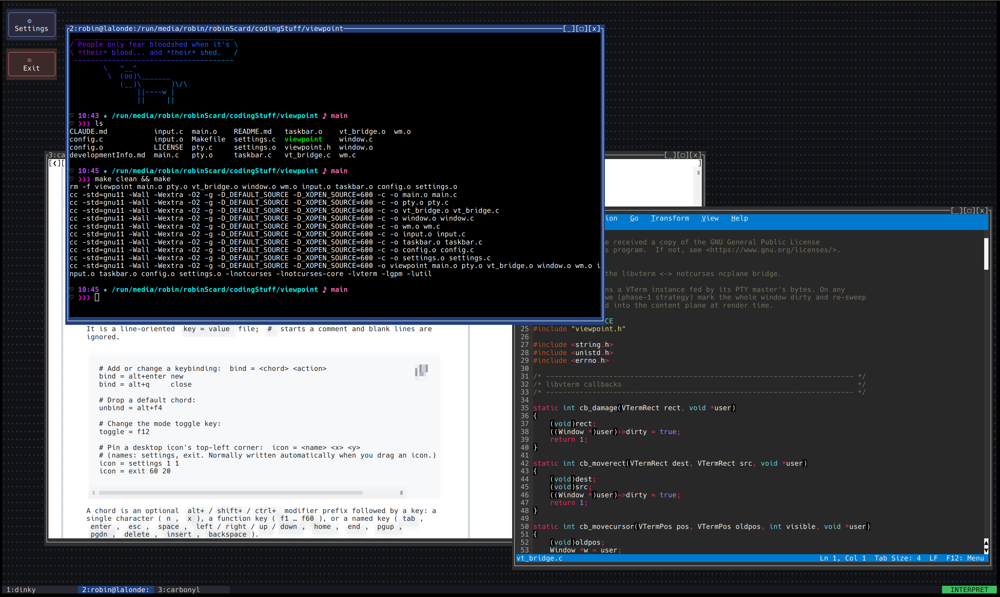

**Note: Turns out writing a compositor from scratch is hard! I haven't abandoned this project and I know it's buggy, I'm just struggling to do meaningful work on it.**

viewpoint is a terminal multiplexer with a desktop-window-manager metaphor for Linux.



viewpoint presents floating windows in a WIMPy interface on your terminal. Each window runs its own shell (or any program) in a dedicated PTY, but with the amazing 1990s innovations in window chrome: draggable borders, a title bar with minimize/maximize/close buttons, and a taskbar. You move, resize, raise, snap, minimize and maximize windows with the mouse or keyboard, similarly as on a graphical desktop.

Early in development, things will change.

## Build and dependencies

```sh
make
```
You need the development headers and libraries for notcurses, libvterm, libsixel and GPM, plus a C toolchain with `forkpty` (from libutil, part of glibc).

On Arch Linux: `sudo pacman -S notcurses libvterm libsixel gpm base-devel`

On Debian: `sudo apt install libvterm-dev libsixel-dev libgpm-dev build-essential cmake ninja-build libavdevice-dev libunistring-dev` (notcurses is not packaged in Debian 13, so install it from [source](https://github.com/dankamongmen/notcurses) and run `sudo ldconfig`, or wait for Debian 14)

notcurses, libvterm and libsixel are located via `pkg-config`. GPM is linked directly with `-lgpm`. For a mouse on the bare Linux console, you also need the `gpm` daemon running.

## Run

```sh
./viewpoint
```
viewpoint expects to fully own the terminal. Running viewpoint inside another multiplexer will not work and is not supported. I don't see any reason why running another multiplexer _inside_ viewpoint shouldn't work, but that isn't formally supported either.

## Usage

### Modes

viewpoint has one global toggle that flips between two modes:

- INTERPRET: window-manager chords (below) are handled by viewpoint; everything else is forwarded to the focused window's program.
- PASSTHROUGH: every keystroke (except the toggle key) is forwarded to the focused program

The toggle key works in both modes and is never forwarded to a program (except the settings menu). The current mode is shown on on the taskbar (`INTERPRET` / `PASSTHROUGH`).

We try to support all reasonably behaved terminals, but some deliver certain key combinations oddly (or never get them due to the DE capturing them, e.g. `Alt`+`Tab`).

### Keymap

These are the default keybinds. They are fully editable through an in-app settings menu, or manually editing an XDG-style config file that it generates.

| Key                           | Action                                   |
|-------------------------------|------------------------------------------|
| `F12`                         | Toggle INTERPRET ↔ PASSTHROUGH mode      |
| `Alt`+`Tab`                   | Focus next window                        |
| `Alt`+`Shift`+`Tab`           | Focus previous window                    |
| `Alt`+`n`                     | New window                               |
| `Alt`+`F4`                    | Close focused window                     |
| `Alt`+`m`                     | Minimize focused window                  |
| `Alt`+`x`                     | Toggle maximize of focused window        |
| `Alt`+`1` … `Alt`+`9`         | Focus / restore window in taskbar slot N |
| `Alt`+`←`/`→`/`↑`/`↓`         | Move focused window                      |
| `Alt`+`Shift`+`←`/`→`/`↑`/`↓` | Resize focused window                    |
| `Shift`+`PgUp` / `Shift`+`PgDn` | Scroll the focused window's scrollback back / forward |
| `Alt`+`,` / `Alt`+`.`         | Scroll the taskbar left / right (when more windows are open than fit) |

### Mouse

| Action                                        | Effect                                   |
|-----------------------------------------------|------------------------------------------|
| Click an unfocused window                     | Focus / raise it                         |
| Click `[_]` / `[▢]` / `[x]` title buttons     | Minimize / maximize / close              |
| Drag the title bar                            | Move the window                          |
| Drag a window border or corner                | Resize the window                        |
| Scroll the wheel over a window                | Scroll its scrollback (forwarded to the app instead if it grabbed the mouse) |
| Drag the title bar to a screen edge / corner  | Snap to half / quarter (outline preview shown; applied on release) |
| Click a taskbar slot                          | Focus, or restore if minimized           |
| Horizontal scroll / click the `◄` `►` arrows  | Scroll the taskbar when more windows are open than fit |
| Click the taskbar mode region                 | Toggle global mode                       |
| Click a desktop icon                          | Perform the corresponding action         |
| Drag a desktop icon                           | Move it; its position is remembered in the config file |

## Configuration

viewpoint reads an config file from `$XDG_CONFIG_HOME/viewpoint/viewpoint.conf`. It will be created automatically on first run. It can be manually edited, and the in-app settings menu also stores configuration in this file.

### In-app settings panel

The `⚙ Settings` icon at the top-left of the desktop opens a modal settings panel. It lands on a grid of tiles; pick a tile (click, or `↑`/`↓`/`←`/`→` then `Enter`) to open it. A click outside the panel (or `Esc`) closes the panel.

The `Keybindings` tile opens the keybinding editor. It lists every action with its current keybinding.

- `↑`/`↓` (or click a row) to select an action
- `Enter` (or click the row again) then press the chord you want. Changes take effect instantly.
- `D` to unbind the selected action
- `S` to save now, `Esc` (or click outside the panel) to return to the grid

The `Appearance` tile changes the look:

- `↑`/`↓` (or click a row) to select a row
- `←`/`→` to change the `Theme`, `Background` mode, `Image fit`, or the `Keep tweaks on theme switch` toggle (applied instantly as a live preview)
- `Enter` on `Image path` to type/paste a background image file; `Enter` on a color row to type a hex color (`RRGGBB`)
- `D` resets the selected color (or clears the image) back to the theme's default
- By default, switching the theme resets your per-color and background tweaks so the new preset applies fully; flip `Keep tweaks on theme switch` to `yes` to carry them across theme changes instead
- `S` to save now, `Esc` (or click outside the panel) to return to the grid

The `Terminal` tile adjusts per-window scrollback behavior:

- `↑`/`↓` (or click a row) to select a setting
- `←`/`→` (or the mouse wheel) to adjust it — `Scrollback lines` (history retained per window; `0` disables it) and `Scroll step` (lines moved per wheel notch). Changes apply to open windows immediately.
- `S` to save now, `Esc` (or click outside the panel) to return to the grid

If a setting you change is also governed by your manual config section, the status line warns you, but the manual section wins, so that change won't survive a restart.

### Configuration file

The config file has two parts:

```conf
# viewpoint config

# in-app/automatically set configuration:
# ...the editor manages this section, don't edit it by hand...
# manual configuration:
# ...your hand-written settings live here and are preserved verbatim...
```

### Editing the file by hand

It is a line-oriented `key = value` file; `#` starts a comment and blank lines are ignored. 

```conf
# Add or change a keybinding:  bind = <chord> <action>
bind = alt+enter new
bind = alt+q     close

# Drop a default chord:
unbind = alt+f4

# Change the mode toggle key:
toggle = f12

# Terminal behavior:
scrollback  = 2000   # per-window scrollback lines (0 disables it)
scroll_step = 3      # lines scrolled per mouse-wheel notch

# Theme (presets: midnight, paper, forest, amber, mono):
theme = forest

# Desktop background (overrides the theme's): one of
background = solid               # flat fill in the theme's colors
background = pattern ✦           # tile a glyph across the desktop
background = image ~/wall.png    # an image (needs a pixel-capable terminal)
bg_fit     = stretch             # image fit: stretch | scale | center | tile

# Override an individual color on top of the chosen theme:  color = <element> <hex>
color = title_focus_bg 802040
color = desktop_bg     101216

# Keep color/background overrides when switching themes (default false, i.e. a
# theme switch resets them so the new preset applies in full):
keep_customizations = false

# Pin a desktop icon's top-left corner:  icon = <name> <x> <y>
# (names: settings, exit. Normally written automatically when you drag an icon.)
icon = settings 1 1
icon = exit 60 20
```

A chord is an optional `alt+`/`shift+`/`ctrl+` modifier prefix followed by a key: a single character (`n`, `x`), a function key (`f1`…`f60`), or a named key (`tab`, `enter`, `esc`, `space`, `left`/`right`/`up`/`down`, `home`, `end`, `pgup`, `pgdn`, `delete`, `insert`, `backspace`).

The available actions are: `focus_next`, `focus_prev`, `new`, `close`, `minimize`, `maximize`, `move_left`/`move_right`/`move_up`/`move_down`, `resize_left`/`resize_right`/`resize_up`/`resize_down`, `scroll_up`/`scroll_down` (scroll the focused window's scrollback history), `slot1`…`slot9` (focus/restore the window in taskbar slot N), and `taskbar_left`/`taskbar_right` (scroll the taskbar's window slots).

## Graphics

viewpoint renders inline sixel images (but it's still kinda busted, working on this. sixels MAY mess up your state right now). This needs a terminal that itself supports sixel or kitty graphics. For technical reasons, graphics are re-composited, so viewpoint may take an inner application outputting sixel and reencode it as kitty depending on your terminal settings. On a terminal without graphics support, the sixel is silently dropped. 

### Graphics limitations

Resizing a window clears its images (the reflow isn't tracked for fixed-pixel placement), and an image only partway on-screen is hidden until it fully fits.

## Roadmap

* kitty graphics passthrough support
* viewpoint-native widget framework

### Maybes

* fake framebuffers for raw-framebuffer-writing graphics support?

## Acknowledgements

This project uses the following libraries:

- [notcurses](https://github.com/dankamongmen/notcurses)
- [libvterm](https://www.leonerd.org.uk/code/libvterm/)
- [libsixel](https://github.com/saitoha/libsixel)
- [GPM](https://www.nico.schottelius.org/software/gpm/)

---

This project is licensed under the GNU General Public License v3.0 only (`GPL-3.0-only`), and the borrowed Linux-kernel `.clang-format` is GPL-2.0-only.
